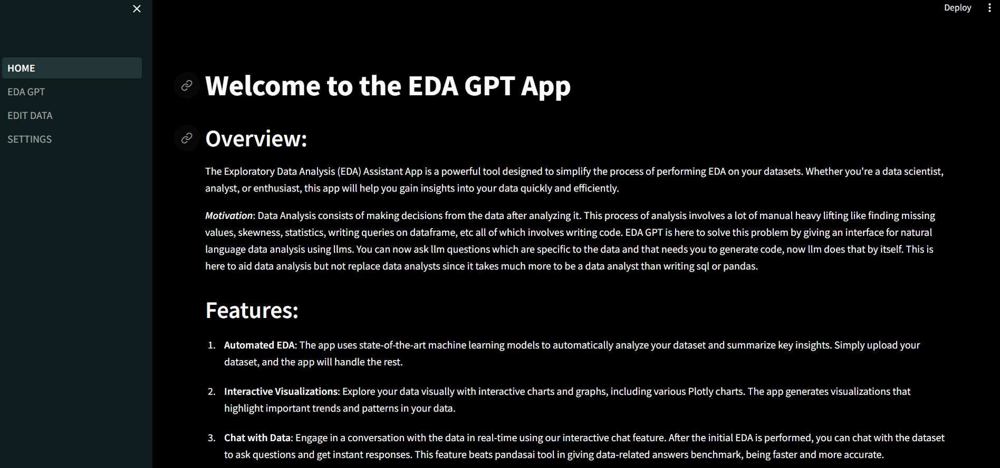
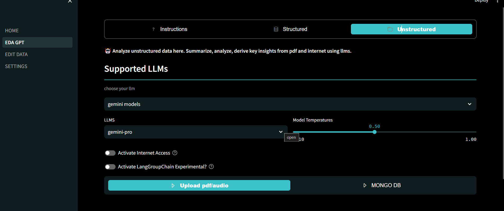
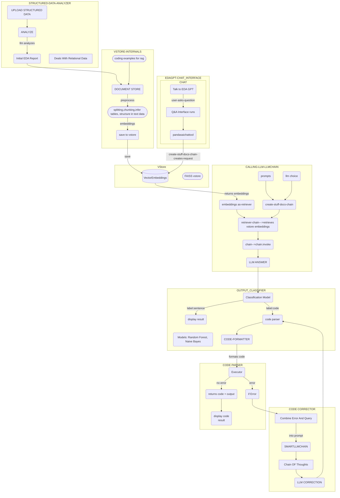
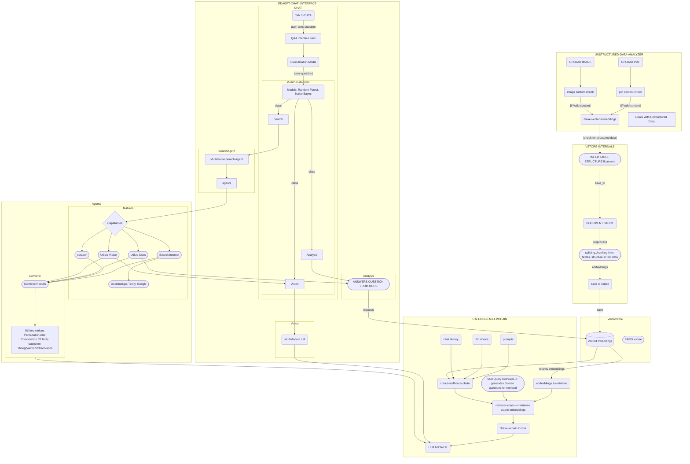

## EDA GPT: Your OpenSource Data Analysis Companion






Welcome to EDA GPT, your comprehensive solution for all your data analysis needs. Whether you're analyzing structured data in CSV, XLSX, or SQLite formats, generating insightful graphs, or conducting in-depth analysis of unstructured data such as PDFs and images, EDA GPT is here to assist you every step of the way.

### Introduction
EDA GPT streamlines the data analysis process, allowing users to effortlessly explore, visualize, and gain insights from their data. With a user-friendly interface and powerful features, EDA GPT empowers users to make data-driven decisions with confidence.

#### DEMO VIDEO : https://genny.lovo.ai/share/d6b58f0d-fc46-4aa7-a65e-fa0f9a684f01


### Getting Started
To get started with EDA GPT, simply navigate to the app and follow the on-screen instructions. Upload your data, specify your analysis preferences, and let EDA GPT handle the rest. With its intuitive interface and powerful features, EDA GPT makes data analysis accessible to users of all skill levels.


### How to Use the App
1. **Structured Data Analysis**:
   - Analyze structured data by uploading files or connecting to databases like PostgreSQL. Supports csv,xlxs & sqlite
   - Provide additional context about your data and elaborate on desired outcomes for more accurate analysis.


2. **Graph Generation**:
   - Generate various types of graphs effortlessly by specifying clear instructions.
   - Access the generated code for fine-tuning and customization.

3. **Analysis Questions**:
   - Post initial EDA, ask analysis questions atop the generated report.
   - Gain insights through Plotly graphs and visualization reports.

4. **Comparison of Performance**:
   - Compare the performance of EDA GPT & pandasai based on accuracy, speed, and handling complex queries.

   ```mermaid
   xychart-beta
    title "Comparison of EDA GPT(blue) and PandasAI Performance(green)"
    x-axis ["Accuracy", "Speed", "Complex Queries"]
    y-axis "Score (out of 100)" 0 --> 100
    bar EDA_GPT [90, 92, 90]
    bar PandasAI [85, 90, 70]
   ```

5. **LLMs (Large Language Models)**:
   - Choose from a variety of LLMs based on dataset characteristics. Supports HuggingFace,Openai,Groq,Gemini models.
   Claude3 & GPT4 is available for paid members.
   - Consider factors such as dataset size and analysis complexity when selecting an LLM. Models with large context length tend to work better for larger datasets.

6. **Unstructured Data Analysis**:
   - Analyze unstructured PDF data efficiently. Table structure and Images are infered from unstructured data for better analysis.
   - Provide detailed descriptions to enhance LLM decision-making.
   - Has Internet Access and follows action/Observation/Thought principle for solving complex tasks.

7. **Multimodal Search**:
   - Search answers from diverse sources including Wikipedia, Arxiv, DuckDuckGo, and web scrapers.
   - Analyze images with integrated Large vision models.

8. **Data Cleaning and Editing**:
   - Clean and edit your data using various methods provided by EDA GPT.
   - Benefit from automated data cleaning processes, saving time and effort.
### Key Features:

1. Capable of analyzing impressive volume of structured and unstructured data.
2. Unstructured data like audio files, pdfs, images can be analyzed. Youtube video can be analyzed as well for summarizing content.
3. Special class called Lang Group Chain is designed to handle complex queries. It is currently unstable but the architecture is useful and can be enhanced upon. It essentially breaks down a primary question into subquestions represented as nodes. Each node have some dependency or codependency. Special data structures called LangGroups stores these Lang Nodes. These are sorted in topological order and grouped on basis of same indegree. Each group is passed to llm with previous context to iteratively reach the answer.
This kind of architecture is useful in questions like : **Find M//3 + 2 where M is age difference between Donald Trump and Joe Biden plus the years taken for pluto to complete one revolution.**
Notice we need to form sequence of well defined steps to solve this like humans do.
This costs more llm calls.

4. Advanced rag like multiquery and context filtering is used to get better results. Tables are extracted while making embeddings if any.

5. In Structured EDA GPT section you are provided with interactive visualizations, pygwalker integration, context rich analysis report.

6. You can talk to EDA GPT and ask it to generate visuals, compute complex queries on dataframe, derive insights, see relationships between features and more. ALl with natural language.
7. A wide range of llms are supported and keeping privacy in mind, one can use ollama models for offline analysis.
8. Autoclean is implemented to clean data based on various parameters like linear-regression.
9. Classificatio models are used for faster inference instead of using llms for explicit classification wherever it's needed.

***NOTE*** : It is advised to provide context rich data manually to the llm before analysis for better results after it is done.


*RECOMMENDATIONS* : Gemini, OpenAI, Claude3 & LLAMA 3 models work better than most other models.


--------------------------------------------------------------------------------------------------------------------------------------
**System Architecture**

1. **Structured Data EDA**




2. **Unstructured Data EDA**





### Why FAISS is used as vector database for structured section?

- FAISS Uses Inverted File Based indexing strategy to index the embeddings which is suitable for datasets ranging from 10MB to around 2GB. For higher memory demanding datasets, graph based indexing , hybrid indexing or disk indexing can be used. For most day-to-day purposes FAISS is a good choice.

- Chroma database is used for comparatively larger files with more text corpus (example : pdf of 130 pages). It uses Hierarchical Navigable Samll World algorithm for indexing which is good for knn algorithm while performing similarity search.


### Optimizations in the application?

- EDA GPT is optimized for maximal parallel processing. It embeds a huge list of documents and adds them to chroma parallelly.

- It is heavily optimized for searching internet, documents and creating analysis reports from structured and unstructured data.

- Advanced retrieval techniques like multiquery retrieval, emsemble retrieval combined with similarity search with a high threshold is used to get useful documents.

- A large language model with high context window like gemini-pro-1.5 works best for large volumes of data. Since llms have a limit for context, it is not recommended to feed humungous amount of data in one go. We recommend to divide a huge pdf into smaller pdfs if possible and process independent data in one session. For example a pdf of 1000 pages with over 5 * 10^6 words should be divided for efficiency.

- data is cached at every point for faster inference.


### Example Of Structured Data Analysis with EDA GPT:
- link to notebook: https://colab.research.google.com/drive/1vqMTPWeSlF7iYG06PFkrYw9lxcnrrmaE?usp=sharing#scrollTo=9dzFcTeY53eG


### For Indepth Understanding Of The Application Check Out [Check out the Low Level Design documentation as markdown](LLD.md) and [High Level Design pdf](pages/src/Database/assets/HLD.pdf)

## How to start the app

To use this app, follow these steps:

1. **Clone the repository**:
   ```bash
   git clone https://github.com/shaunthecomputerscientist/EDA-GPT.git
   cd EDA-GPT
2. **Make a virtual environment and install dependencies**:
   ```bash
      pip install -r requirements.txt
3. **Start the app**:
   ```bash
      streamlit run Home.py
   ```


### Feedback and Support
We value your feedback and are constantly working to improve EDA GPT. If you encounter any issues or have suggestions for improvement, please don't hesitate to reach out to our support team. developer contact : mrpolymathematica@gmail.com


###### Key Note : This project was made as part of ineuron internship project within a month.