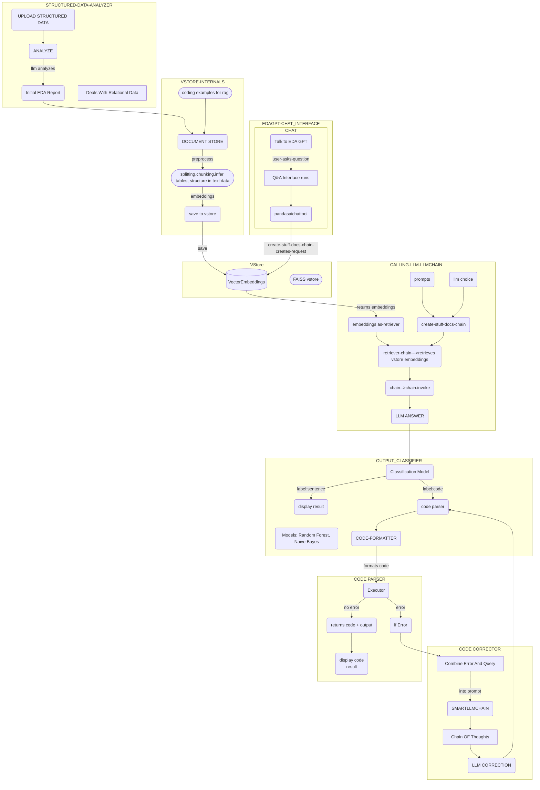
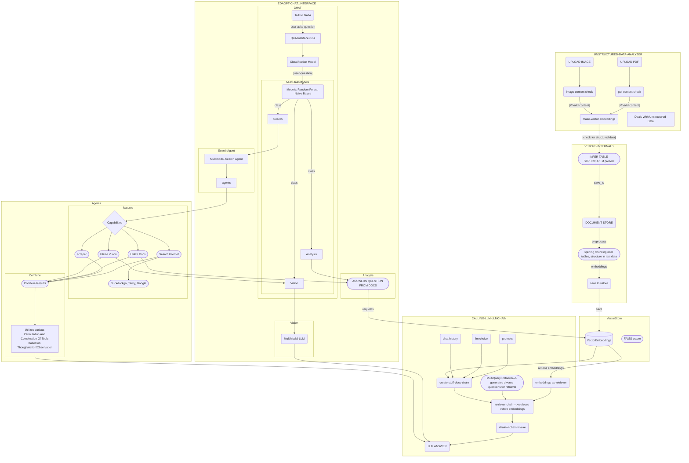

# EDA GPT App Documentation

## Contents
- [Project Folder Structure](#project-folder-structure)
- [Introduction and Use](#introduction-and-use)
- [Features](#features)
- [Understanding the Code](#understanding-the-code)
  - [Structured Data Analysis](#structured-data-analysis)
  - [Unstructured Data Analysis](#unstructured-data-analysis)
  - [Why Classification Models are Used](#why-classification-models-are-used)
  - [Specific File Descriptions](#specific-file-descriptions)
  - [Diving Into Codebase](#classes-and-functions)

# Project Folder Structure

## Root Directory
- Pages/
  - Home.py
  - README.md
  - packages.txt
  - requirements.txt
  - license.txt
  - .gitignore
  - test-data/
  - .streamlit/
    - config.toml
    - secrets.toml

## Pages Directory
- Pages/
  - Home.py
  - README.md
  - packages.txt
  - requirements.txt
  - license.txt
  - .gitignore
  - test-data/
  - src/
    - EDA_GPT.py
    - EDIT_DATA.py
    - SETTINGS.py
    - src/
      - EDA.py
      - setup.py
      - connector.py
      - data.py
      - unstructured_data.py
      - structured_data.py
      - vstore.py
      - Tools/
        - langroupchain_custom.py
        - llms.py
        - scraper.py
        - secrets.py
        - tasks.py
        - tools.py
      - Database/
        - assets/
        - charts/
        - csvdata/
        - Plots/
        - Prompts/
        - sqlite/
        - structured/
        - unstructured/
        - userdata/
        - xlsxdata/
        - config.json
      - Models/
        - Classification-models...
      - Instructions/
        - instruction.py

## Introduction and Use
The EDA GPT App utilizes machine learning and language models to automate and simplify the EDA process. It allows users to upload data in various formats (CSV, XLSX, SQLite, PostgreSQL) and perform comprehensive analysis with interactive visualizations and a chat interface.

### How to Use the App:
1. **Upload Data:** Choose the data source and upload your dataset.
2. **Perform EDA:** Click "Perform EDA" to initiate the analysis.
3. **Explore Visualizations:** Interact with the generated charts and graphs.
4. **Chat with Data:** Ask questions about your data and receive instant responses.
5. **Download Reports:** Save the EDA report, visualizations, and modified data.

## Features
- **Automated EDA:** The app automatically analyzes your dataset and generates a summary report with key insights and visualizations.
- **Interactive Visualizations:** Explore your data with interactive charts and graphs powered by Plotly.
- **Chat with Data:** Engage in a natural language conversation with your data to gain deeper insights.
- **Edit CSV Data:** Clean and edit your CSV data directly within the app.
- **Multiple Language Models:** Choose from various language models (GPT-4, CLAUDE3, GROQ, MIXTRAL) depending on your needs.
- **Support for Structured and Unstructured Data:** Analyze both structured data (CSV, XLSX, SQLite, PostgreSQL) and unstructured data (PDFs, images).
- **Multimodal Search:** Search for answers from various sources such as Wikipedia, Arxiv, DuckDuckGo, and web scrapers.

## Understanding the Code:
### 1) Structured Data Analysis:
- **Home.py:** This file provides the user interface and instructions for using the app.
- **setup.py:** This file handles data uploading, data source selection, and environment setup.
- **data.py:** This file handles data reading from different sources (CSV, XLSX, SQLite, PostgreSQL).
- **connector.py:** This file provides connectors for PostgreSQL and SQLite databases.
- **structured_data.py:** This file performs EDA on structured data using the EDAAnalyzer class and generates an analysis report.

### 2) Unstructured Data Analysis:
- **unstructured_data.py:** This file handles the analysis of unstructured data (PDFs, images) using vector stores and language models.
- **vstore.py:** This file manages the creation and loading of vector stores for efficient retrieval of relevant information from unstructured data.

### Why Classification Models are Used?
Classification models are used in the app to determine the type of user query and provide the appropriate response. This helps to direct the query to the correct analysis module (structured or unstructured) and ensure accurate results.

### Specific File Descriptions:
- **Home.py:** Sets the page title and layout. Displays the welcome message and an overview of the app. Lists the features of the app. Provides instructions on how to use the app. Lists supported data formats. Includes a disclaimer and feedback section.
- **EDIT_DATA.py:** Allows users to edit CSV data within the app. Provides options for adding, removing, and cleaning data. Supports various data cleaning techniques like handling missing values and outliers.
- **vstore.py:** Creates and manages vector stores for unstructured data. Preprocesses and chunks text data for efficient retrieval. Supports different embedding models (HuggingFace, Google Palm, GPT4All).
- **tools.py:** Defines tools for multimodal search and analysis. Includes tools for searching Wikipedia, Arxiv, DuckDuckGo, and scraping web pages. Implements a vision tool for image analysis.
- **instructions.py:** Provides detailed instructions on how to use the app for both structured and unstructured data analysis. Explains the different features and functionalities. Offers guidance on selecting appropriate LLMs and data cleaning techniques.
- **scraper.py:** Extracts information about open-source LLMs from the Ollama website.
- **llms.py:** Provides functions for loading different LLMs based on user selection and configuration.
- **structured_data.py:** Implements the main functionality for structured data analysis. Performs EDA using the EDAAnalyzer class and generates reports and visualizations. Provides a chat interface for interacting with the data.
- **EDA.py:** Defines the EDAAnalyzer class, which performs core EDA tasks such as calculating summary statistics, identifying missing values, and generating visualizations. Implements functions for code generation and execution based on user queries.
- **data.py:** Handles reading data from different sources (CSV, XLSX, SQLite, PostgreSQL). Utilizes connectors for database access.
- **connector.py:** Provides connectors for PostgreSQL and SQLite databases.
- **EDA_GPT.py:** The main entry point for the app. Initializes the data manager and structured/unstructured data analyzers. Provides the user interface for selecting data categories and initiating analysis.

**DIVING INTO CODEBASE**

### classes-and-functions
### Home.py - No classes present
This file primarily focuses on setting up the user interface and displaying information about the app. It does not contain any class definitions.

### EDIT_DATA.py
#### DataFrameModifier Class:
This class provides functionalities for editing and cleaning data within the app.
##### Methods:
- __init__(): Initializes the class and sets up session state variables for storing the modified data.
- display(): Displays the data using Streamlit's st.data_editor function.
- add_row(): Allows users to add new rows to the dataframe by providing input values for each column.
- remove_row(): Allows users to remove rows from the dataframe based on selected indices.
- cleanData(): Cleans the data using the AutoClean library with various options for handling duplicates, missing values, categorical encoding, and outliers.
- drop_column(): Allows users to drop selected columns from the dataframe.
- restore(): Restores the data to its initial state before any modifications.
- download_csv(): Downloads the modified data as a CSV file.
- upload_csv(): Uploads a CSV file and reads it into a pandas DataFrame.

### vstore.py
#### VectorStore Class:
This class manages the creation and loading of vector stores for efficient retrieval of relevant information from unstructured data.
##### Methods:
- __init__(): Initializes the class, loads configuration data, and sets up directory paths for unstructured data and vector stores.
- makevectorembeddings(): Processes and chunks text data from the specified directory, creates embeddings using the chosen embedding model, and builds a FAISS vector store.
- _savevectorstores(): Serializes the vector store and saves it to a file for later use.
- loadvectorstores(): Loads a serialized vector store from a file.
- _preprocess_text(): Preprocesses text data by converting to lowercase, tokenizing, removing stop words and punctuation, and applying stemming and lemmatization.
- _preprocess_data_in_directory(): Preprocesses all files in the specified directory, including text extraction from PDFs and table extraction using Camelot.

### tools.py
This file defines tools for multimodal search and analysis. Each tool is decorated with the @tool decorator to make it accessible within LangChain's agent framework.
##### Tools:
- wikipedia(): Searches Wikipedia for information based on a user query.
- arxiv(): Searches Arxiv for research papers based on a user query.
- duckduckgonews(): Searches DuckDuckGo News for news articles related to a user query.
- duckduckgo(): Searches DuckDuckGo for general information related to a user query.
- Tavilysearchapi(): Searches Tavily for research-backed and detailed answers to user queries.
- Scraper(): Scrapes content from a given URL.
- Vision(): Analyzes images and answers questions about them using a vision model (e.g., Google Vision API).

### instructions.py - No classes present
This file provides instructions on using the app for both structured and unstructured data analysis. It does not contain any class definitions.

### scraper.py - No classes present
This file contains functions for scraping information about open-source LLMs from the Ollama website. It does not contain any class definitions.

### llms.py - No classes present
This file provides functions for loading different language models based on user selection and configuration. It does not contain any class definitions.

### unstructured_data.py
#### unstructured_Analyzer Class:
This class handles the analysis of unstructured data (PDFs, images) using vector stores, language models, and tools defined in tools.py.
##### Methods:
- __init__(): Initializes the class, loads configuration data, sets up directory paths, and initializes session state variables.
- _upload_pdf(): Allows users to upload PDF files for analysis.
- _upload_image(): Allows users to upload images for analysis and select a vision model.
- _IsGenerator(): Checks if an object is a generator function or generator type.
- _decision(): Uses a classification model to determine the type of user query (e.g., analysis, vision, search).
- _vstore_embeddings(): Creates embeddings and builds a vector store for the uploaded unstructured data.
- _promptformatter(): Formats prompts for the language models based on user input, context, and available tools.
- _get_llm(): Loads the selected language model.
- datanalystbot(): Analyzes unstructured text data using a retrieval-augmented language model chain.
- Multimodalagent(): Creates a Crew agent with various tools (e.g., vision, search engines, data analysis) to answer user queries in a multimodal way.
- sidebarcomponents(): Sets up the sidebar UI elements for uploading images and providing data descriptions.
- workflow(): Manages the overall workflow for unstructured data analysis, including data uploading, LLM selection, and query handling.

### structured_data.py
#### EDAGPT Class:
This class provides the main functionality for structured data analysis, utilizing the EDAAnalyzer class from EDA.py.
##### Methods:
- __init__(): Initializes the class, sets up the data handler, dataframe environment, and session state variables.
- _initializer(): Sets up the user interface elements for LLM selection and data loading.
- create_context(): Allows users to provide additional context about the data, such as a description and specific questions.
- analyze_data(): Performs EDA on the loaded data using the EDAAnalyzer and generates a report with visualizations.
- regenerate(): Re-runs the EDA and regenerates the report and visualizations.
- messagesinterface(): Handles the display of chat messages between the user and the data.
- chat_interface(): Allows users to interact with the data using a chat interface powered by the pandasaichattool method of the EDAAnalyzer.
- run(): Manages the overall workflow for structured data analysis, including data loading, EDA execution, and chat interaction.

### EDA.py
#### EDAAnalyzer Class:
This class performs the core tasks of Exploratory Data Analysis, including calculating statistics, generating visualizations, and answering user queries.
##### Methods:
- __init__(): Initializes the class, sets up data and configuration parameters, and loads classification models.
- _get_llm(): Loads the selected language model.
- perform_eda(): Calculates summary statistics, identifies missing values, and prepares data for further analysis and visualization.
- fetch_formated_data(): Formats data into a text summary for use with the EDAAgent.
- _execute_generated_code(): Executes code generated by the language model in a restricted environment.
- handle_single_code_block(): Formats and extracts relevant code blocks for execution.
- _format_code(): Formats the generated code by removing unnecessary elements and ensuring proper structure.
- _promptformatter(): Formats prompts for the language models with specific instructions for generating code or text responses.
- _feedback_instructions(): Formats prompts for the language model to provide feedback on incorrect code and generate corrections.
- _texttypedecision(): Uses a classification model to determine if the generated response should be a code block or a text sentence.
- pandasaichattool(): Processes user queries and generates responses (code or text) using a retrieval-augmented language model chain and the formatted data.
- EDAAgent(): Generates a comprehensive EDA report using a Crew agent and the formatted data, addressing specific user questions.
- _save_edadata(): Saves the EDA report to a file.
- _clean_charts(): Clears any existing chart files before generating new ones.
- clear_EDA_and_chats(): Clears EDA reports and chat history files.
- saveNdownload_eda(): Saves the EDA report and prepares it for download.
- eda_sweetviz(): Generates an HTML report with visualizations using the Sweetviz library.
- streamlitplots(): Generates various plots using Plotly and Seaborn for numerical and   categorical data.
- data_interface(): Provides an interactive data exploration interface using the PyGWalker library.

## Unstructured Data Analysis Code Deep Dive

### setup.py
This file plays a crucial role in setting up the environment for structured data analysis. However, it does not directly interact with unstructured data processing.

#### Classes:
**DataFrameEnvironment:**
##### Methods:
- __init__(): Initializes the class and creates a placeholder for displaying dataframes using Streamlit.
- load_data(dataframe): Loads the given pandas DataFrame into the class for further processing and display.
- display(data): Displays the loaded DataFrame using Streamlit's st.dataframe function with caching enabled for performance optimization.
- add_row(): (Not used in the current implementation) Allows adding a new row to the DataFrame.

**DataManager:**
##### Methods:
- __init__(config_data, config_file_path): Initializes the class with configuration data and file path.
- Database specific methods (postgres_data, sqlite_data, csv_data, xlsx_data): These methods handle the connection and data reading from different data sources based on user selection. They utilize the DataReader class to perform the actual reading.
- get_data(): Presents the user with a selection for data source type (Postgres, SQLite, CSV, XLSX) and calls the appropriate method to retrieve data.
- process_uploaded_file(uploaded_file, file_type): Processes the uploaded file, extracts the table name, saves the file, and calls the appropriate data reading method based on file type.
- get_table_name(file_type, uploaded_file): Extracts the table name from the uploaded file name or user input.
- save_uploaded_file(uploaded_file, file_type, table_name): Saves the uploaded file to the designated directory and updates the configuration file with the current table name.
- remove_existing_files(directory): Clears any existing files in the specified directory to avoid conflicts.
- _reset_data(): Resets data-related variables to their initial state.

### connector.py
This file provides connectors for structured databases (PostgreSQL and SQLite). It's not directly involved in handling unstructured data.

#### Classes:
**PostgresConnector:**
##### Methods:
- __init__(host, port, dbname, user, password): Initializes the connector with PostgreSQL connection details.
- connect(): Establishes a connection to the PostgreSQL database using the provided credentials.
- extract_table_to_dataframe(table_name, batch_size=10000): Extracts data from the specified table in batches and returns it as a pandas DataFrame.

**SQLiteConnector:**
##### Methods:
- __init__(db_folder): Initializes the connector with the folder path containing the SQLite database file.
- connect(): Establishes a connection to the SQLite database.
- sqlite_to_dataframe(table_name): Extracts data from the specified table and returns it as a pandas DataFrame.

### unstructured_data.py
This file forms the core of unstructured data analysis, leveraging LangChain and other libraries.

#### Classes:
**unstructured_Analyzer:**
##### Methods:
- __init__(config_data, prompt_data): Initializes the class with configuration and prompt data, sets up directory paths, and initializes session state variables.
- _upload_pdf(): Allows users to upload PDF files for analysis and stores them in the session state.
- _upload_image(): Allows users to upload images for analysis and select a vision model.
- _IsGenerator(): Checks if an object is a generator function or generator type.
- _decision(sentence): Classifies the user's query into categories (e.g., analysis, vision) using a pre-trained classification model.
- _vstore_embeddings(uploaded_files): Processes uploaded files, extracts text content, builds a vector store using the VectorStore class, and stores the retriever in the session state.
- _promptformatter(): Creates prompt templates for LangChain agents, incorporating user input, context, and available tools.
- _get_llm(): Loads the selected language model using the get_llm function from llms.py.
- datanalystbot(query, context=" "): Analyzes unstructured text data using a retrieval-augmented language model chain, leveraging the vector store and prompt templates.
- Multimodalagent(query): Creates a Crew agent with various tools for multimodal analysis, including vision, search engines, and the datanalystbot for document analysis.
- sidebarcomponents(): Sets up the sidebar UI elements for uploading images and providing data descriptions.
- workflow(): Manages the overall workflow for unstructured data analysis, including LLM selection, data uploading, and handling user queries using appropriate tools and methods based on the classified query type.

## Additional Code Explanations

### llms.py
This file acts as a central hub for loading various large language models (LLMs) supported by the EDA GPT app.
#### Functions:
- **get_llm(llm_name, temperature, config_data):**
  - Takes the name of the LLM, temperature setting, and configuration data as input.
  - Selects and initializes the appropriate LLM based on the llm_name.
  - Returns the initialized LLM object ready for use in generating text and code.

### tools.py
This file defines several tools used for multimodal search and analysis within the EDA GPT app. These tools are integrated with LangChain's agent framework using the @tool decorator.
#### Tools:
- **Search-oriented tools:**
  - wikipedia(query)
  - arxiv(query)
  - duckduckgonews(query)
  - duckduckgo(query)
  - Tavilysearchapi(query)
- **Data extraction tool:**
  - Scraper(url)
- **Vision tool:**
  - Vision(model)
  - vision(query)

### Database (folder)
This folder contains several files related to data storage and configuration:
- **config.json:** Stores configuration information for the app, including paths to data files and directories, database connection details, supported LLMs and vision models, and configuration for PyGWalker data exploration.
- **Prompts:** This subfolder contains the prompts.json file, which stores various prompt templates used for interacting with LLMs and agents in the app.
- **Plots:** This subfolder stores the generated plots and visualizations during data analysis.
- **userdata:** This subfolder stores user-specific data such as EDA reports and chat history.C
- **charts:** This subfolder stores the HTML reports generated by Sweetviz.
- **relational_vstore:** This subfolder stores the vector store files for unstructured data analysis.

### Data Flow
#### Structured Data Analysis:
- **Data Loading:** The user selects a data source and uploads the data file. DataManager class handles the file saving and calls the appropriate data reader based on file type (e.g., csv_data, xlsx_data).
- **EDA Execution:** EDAGPT class initializes the EDAAnalyzer with the loaded data and selected LLM. The analyze_data method of EDAGPT triggers the EDA process, generating an analysis report and visualizations using the functionalities within EDAAnalyzer.
- **Chat Interaction:** The user interacts with the analyzed data through a chat interface. The chat_interface method in EDAGPT uses the pandasaichattool within EDAAnalyzer to process user queries and generate responses using the chosen LLM and the analyzed data context.
- **Report Generation & Download:** The user can choose to download the generated EDA report and visualizations for further analysis and sharing.

#### Unstructured Data Analysis:
- **Data Upload:** The user uploads PDF files or images. These files are stored in the session state and relevant directories.
- **Vector Store Creation:** The _vstore_embeddings method in unstructured_Analyzer processes the uploaded files, extracts text content, and builds a vector store using the VectorStore class for efficient information retrieval.
- **Query Classification:** When the user submits a query, the _decision method in unstructured_Analyzer utilizes a pre-trained classification model to determine the type of query (e.g., analysis, vision).
- **LLM Selection & Prompt Formatting:** Based on the classified query type, the appropriate LLM is loaded using the _get_llm method, and the prompt is formatted using the _promptformatter method to include relevant information and instructions.
- **Response Generation:** Depending on the query type, the system either uses the datanalystbot method for analyzing text data with the vector store or the Multimodalagent with various tools (e.g., vision, search engines) for a broader analysis.
- **Result Presentation:** The generated response, either text or code, is presented to the user, and any relevant visualizations/image are displayed.

